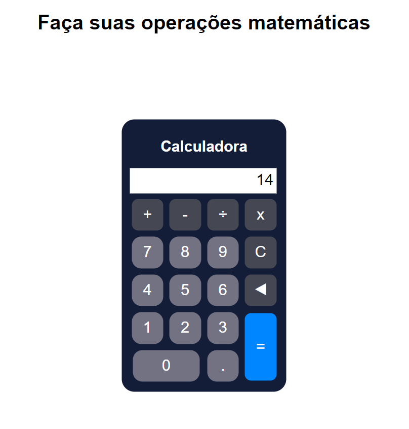

<h1 align="center">Calculadora</h1>

Calculadora desenvolvida em HTML, CSS e JavaScript para a realização de cálculos numéricos, capaz de realizar operações de adição, subtração, multiplicação e divisão. 

  <a href="#-tecnologias">Tecnologias<a>     |    
  <a href="#-projeto">Projeto</a>     |    
  <a href="#-licença">Licença</a>

  

 

  

## 🚀 Tecnologias

Esse projeto foi desenvolvido com as seguintes tecnologias:

- HTML
- CSS
- JavaScript
- Git
- Github
- Visual Studio Code

## 💻 Projeto

Calculadora desenvolvida em HTML, CSS e JavaScript para a realização de cálculos numéricos, capaz de realizar operações de adição, subtração, multiplicação e divisão.

- [ Visite o projeto online ](https://lipeharakawa.github.io/calculadora)

## ✅ Licença

Esse projeto está sob a licença MIT.

---

Feito com ❤️ por Felipe Seidi Harakawa.
